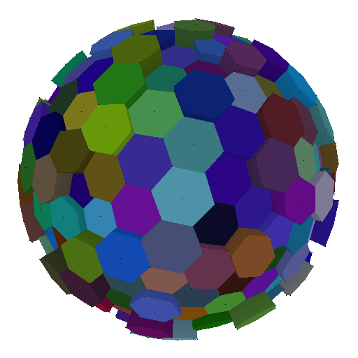

# Icosphere
Icosphere -- a procedurally generated, regularly-tiled sphere made of hexagons and pentagons.



### Description
Icosphere is a computational geometry project written in python and using the wonderful `vispy` library for rendering. The geometry is creating using a basic icosahedron, and can be manipulated in real time to produce different levels and types of tesselation. That doesn't make a whole lot of sense but this is a rough draft.

### Controls
`R` resets the shape to its basic form

`T` tesselates, or subdivides, the shape once

`Y` truncates the shape once

`U` normalizes all vertices, forcing the shape to become spherical

`E` extrudes surface faces (more details below)


### Details
There are two modes of refinement: subdivision and truncation. Subdivision creates a planet purely made of triangles, while truncation makes one made from pentagons and hexagons. Geometrically, the base shape is always an icosahedron. Subdivision creates an 'icosphere' (which honestly I don't know the proper name for), and truncation produces a truncated icosahedron.

Extrusion is an interesting function. It takes each surface face of the sphere and either raises it or lowers it relative to the center of the sphere, producing shapes with more interesting surface topography, like that in the example photo. Each tile becomes a sort of hexagonal tower. Sides are rendered and colored the same as their related top face (although note that sides do not render properly unless the shape has been truncated, and has hexagonal shapes).

### Installation
```
mkdir icosphere
git clone https://github.com/anavros/icosphere.git icosphere/
cd icosphere
./run.py
```
### Dependencies
```
vispy
glfw
rocket (personal library, to be released properly, see https://github.com/anavros/rocket/)
imageio/PIL for screenshots
```
More details coming sometime.
